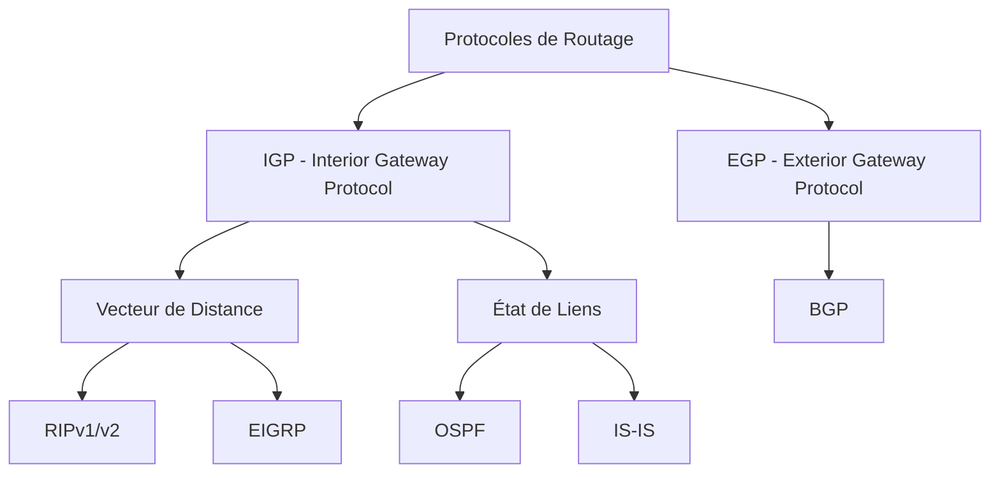
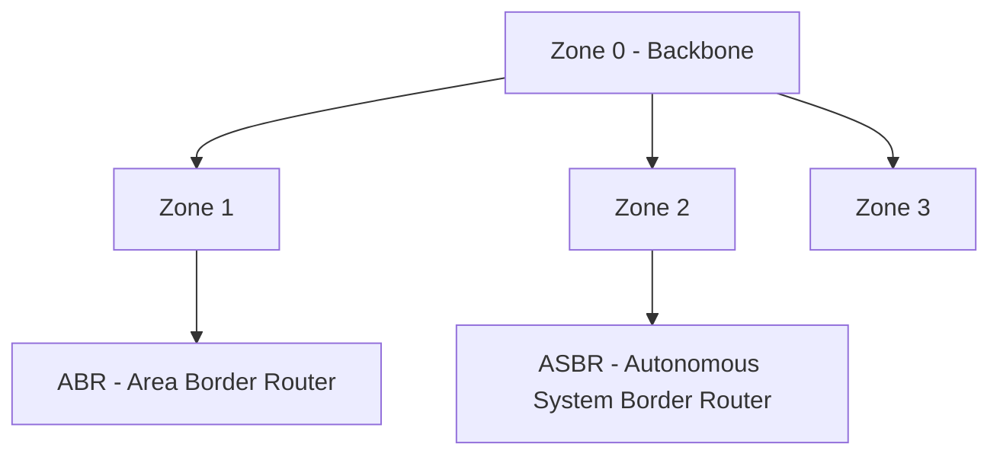

## I. Classification des Protocoles

## I.I Protocoles IGP
### 1. Protocoles à Vecteur de Distance

#### [RIP](RIP%20-%20D%C3%A9tails%20Techniques%20Approfondis) (Routing Information Protocol)
- **Caractéristiques**:
  - Métrique simple (nombre de sauts)
  - Maximum 15 sauts
  - Mises à jour toutes les 30 secondes
  - Convergence lente

- **Version RIPv1 vs RIPv2**

| Caractéristique | RIPv1 | RIPv2 |
|-----------------|-------|--------|
| Type | Par classe | Sans classe |
| VLSM | Non | Oui |
| Diffusion | Broadcast (255.255.255.255) | Multicast (224.0.0.9) |
| Authentification | Non | Oui (MD5) |
| Masque sous-réseau | Non inclus | Inclus |

#### EIGRP (Enhanced Interior Gateway Routing Protocol)
- Propriétaire Cisco
- Métrique composite:
  - Bande passante
  - Délai
  - Charge
  - Fiabilité
- Convergence rapide
- Support VLSM

### 2. Protocoles à État de Liens

#### [OSPF](OSPF%20-%20Détails%20Techniques%20Approfondis) (Open Shortest Path First)

- **Caractéristiques**:
  - Standard ouvert
  - Algorithme Dijkstra
  - Organisation en zones
  - Convergence rapide
  - Support VLSM et CIDR
  - Utilise adresse multicast 224.0.0.5
  
- **Types de routeurs OSPF**:
  - IR (Internal Router)
  - ABR (Area Border Router)
  - ASBR (AS Border Router)
  - BR (Backbone Router)

#### IS-IS
- Similaire à OSPF
- Utilisé par les FAI
- Support multiprotocole natif

## Protocoles EGP

### BGP (Border Gateway Protocol)
- **Caractéristiques**:
  - Protocole standard pour Internet
  - Basé sur des politiques
  - Sessions TCP (port 179)
  - Métriques multiples

- **Fonctionnement**:
  - Échange de routes entre AS
  - Décisions basées sur attributs
  - Support de filtrage extensif

## Comparaisons et choix

### Distances Administratives

| Reliability Level | Route Type      | Metric |
| ----------------- | --------------- | ------ |
| Plus fiable       | Route connectée | 0      |
|                   | Route statique  | 1      |
|                   | EIGRP           | 90     |
|                   | OSPF            | 110    |
| Moins fiable      | RIP             | 120    |

### Tableau Comparatif

| Protocole | Type | Métrique | Convergence | Usage typique |
|-----------|------|----------|-------------|---------------|
| RIPv2 | Vecteur distance | Sauts | Lente | Petits réseaux |
| EIGRP | Hybride | Composite | Très rapide | Réseaux Cisco |
| OSPF | État liens | Coût (bande passante) | Rapide | Entreprises |
| BGP | Vecteur chemin | Multiples attributs | Moyenne | Internet |

### Critères de Choix
1. **Taille du réseau**
   - Petit réseau → RIP
   - Moyen/Grand réseau → OSPF/EIGRP

2. **Type d'équipement**
   - Tout Cisco → EIGRP possible
   - Multi-vendeurs → OSPF/IS-IS

3. **Besoins de convergence**
   - Haute disponibilité → OSPF/EIGRP
   - Tolérant aux délais → RIP suffisant

4. **Complexité d'administration**
   - Configuration simple → RIP
   - Administration avancée → OSPF/BGP

## Points clés à retenir

1. **Protocoles IGP**
   - Pour routage interne
   - Choix basé sur besoins techniques

2. **Protocole BGP**
   - Pour routage inter-AS
   - Choix basé sur politiques

3. **Évolution des protocoles**
   - Abandon progressif de RIP
   - Dominance OSPF/BGP
   - Importance croissante de la sécurisation