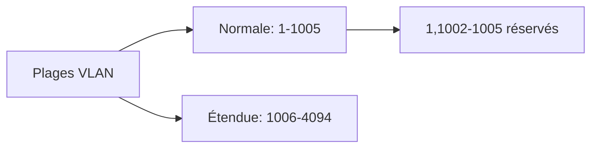
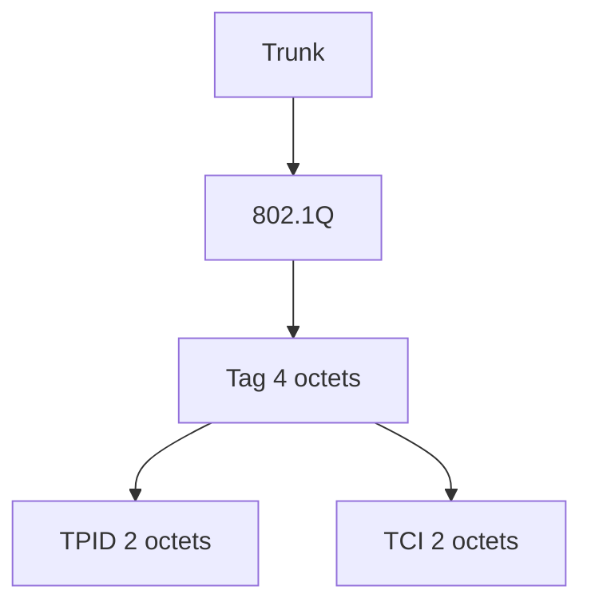

## 1. Introduction aux VLANs

### Avantages des VLANs
1. **Sécurité**
   - Séparation des groupes sensibles
   - Isolement du trafic

2. **Réduction des coûts**
   - Moins de mises à niveau nécessaires
   - Meilleure utilisation bande passante

3. **Performance**
   - Réduction du trafic inutile
   - Domaines de broadcast plus petits

4. **Administration**
   - Gestion simplifiée
   - Organisation logique des utilisateurs

## 2. Types de VLANs

### VLANs par Fonction

1. **VLAN données**
   - Trafic utilisateur uniquement
   - Séparé du trafic voix/gestion

2. **VLAN par défaut**
   - VLAN 1
   - Tous les ports initialement
   - Non supprimable

3. **VLAN natif**
   - Pour trafic non tagué
   - Sur trunk 802.1Q
   
4. **VLAN de gestion**
   - Administration du switch
   - Adresse IP dédiée

5. **VLAN voix**
   - QoS prioritaire
   - Délai < 150ms

### Plages d'ID VLAN



## 3. Configuration des VLANs

### Modes des Ports
1. **Mode Accès**
   - Un seul VLAN
   - Pour utilisateurs finaux
   - Non tagué

2. **Mode Trunk**
   - Multiple VLANs
   - Entre switches
   - Trafic tagué

### Agrégation (Trunking)



## 4. Protocole VTP (VLAN Trunking Protocol)

### Modes VTP
1. **Serveur**
   - Création/Modification VLANs
   - Stockage dans NVRAM
   - Mode par défaut

2. **Client**
   - Pas de modification
   - Synchronisation seulement

3. **Transparent**
   - VLANs locaux uniquement
   - Transmet annonces VTP

### Messages VTP
1. **Summary Advertisement**
   - Toutes les 5 minutes
   - Numéro révision
   - Informations domaine

2. **Subset Advertisement**
   - Informations VLAN détaillées
   - Après modifications

3. **Request Advertisement**
   - Demande d'informations
   - Nouveau switch/reset

## 5. Protocole STP (Spanning Tree Protocol)

### Objectifs
- Prévention des boucles
- Redondance active/standby
- Convergence automatique

### États des Ports

- Disabled 
- Blocking
- Listening
- Learning
- Forwarding


## 6. Routage Inter-VLAN

### Méthodes
1. **Router-on-a-stick**
   - Une interface physique
   - Sous-interfaces logiques
   - Un VLAN par sous-interface

2. **Switch Layer 3**
   - SVI (Switch Virtual Interface)
   - Routage intégré
   - Plus performant

### Configuration Exemple
```
interface GigabitEthernet0/0.10
 encapsulation dot1Q 10
 ip address 192.168.10.1 255.255.255.0

interface GigabitEthernet0/0.20
 encapsulation dot1Q 20
 ip address 192.168.20.1 255.255.255.0
```

## 7. Problèmes Courants et Solutions

### Trunk
1. **Non-concordance VLAN natif**
   - Erreurs console
   - Trafic mal routé

2. **Mode trunk incorrect**
   - Liaison inactive
   - Perte connectivité

### VTP
1. **Numéro révision**
   - Écrasement base VLAN
   - Vérifier avant ajout

2. **Domaine VTP**
   - Isolation domaines
   - Sécurité configuration

## 8. Points Clés pour Examens

1. **Conception VLAN**
   - Identifier besoins segmentation
   - Planifier adressage IP
   - Choisir méthode routage

2. **VTP**
   - Comprendre propagation
   - Importance révision
   - Rôles des modes

3. **STP**
   - États des ports
   - Élection root bridge
   - Coûts des chemins

4. **Sécurité**
   - Isolation trafic
   - Protection trunk
   - VLAN gestion séparé