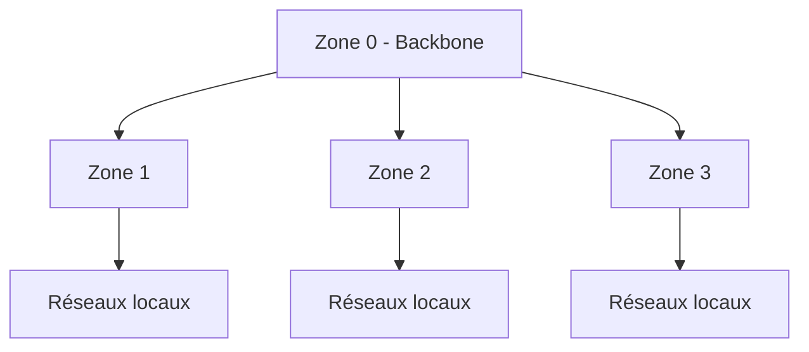
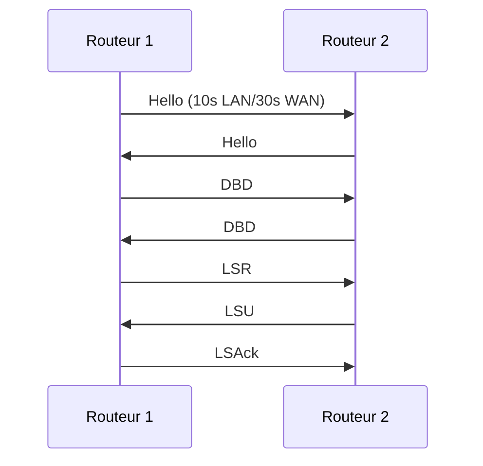
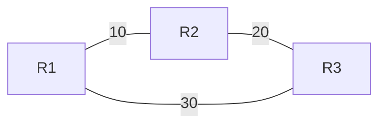

## 1. Concepts Fondamentaux

### Base de Fonctionnement
- Protocole à état de liens
- Algorithme Dijkstra (SPF)
- Support VLSM et CIDR
- Organisation hiérarchique en zones
- Multicast 224.0.0.5 (tous routeurs) et 224.0.0.6 (DR/BDR)

## 2. Types de Routeurs OSPF (Important pour Examens)

| Type de Routeur OSPF     | Description       | Rôle                                                                                       |
| ------------------------ | ----------------- | ------------------------------------------------------------------------------------------ |
| IR - Internal Router     | Une seule zone    | - Tous les ports dans même zone<br>- Base de données état-liens unique                     |
| ABR - Area Border Router | Multiple zones    | - Connecte zones au backbone<br>- Maintient bases données multiples<br>- Route entre zones |
| ASBR - AS Border Router  | Connexion externe | - Connecte OSPF à d'autres AS<br>- Redistribue routes externes                             |
| BR - Backbone Router     | Zone 0            | - Au moins une interface dans zone 0<br>- Peut combiner avec autres rôles                  |
## 3. Structure des Zones (Crucial)

### Règles de Zone
1. **Zone 0 (Backbone)**
   - Obligatoire
   - Toutes zones connectées à zone 0
   - Pas plus de 2 niveaux hiérarchiques
   
2. **Autres Zones**
   - Numérotées de 1 à 65535
   - Connexion directe à zone 0 requise

### Design Hiérarchique


## 4. Calculs de Coût (Très Important pour Examens)

### Formule de Base
$$
Coût = 10^8 / Bande_Passante(bps)
$$

### Exemples de Calculs
| Interface | Bande Passante | Calcul | Coût |
|-----------|----------------|--------|------|
| Fast Ethernet | 100 Mbps | 10^8/10^8 | 1 |
| Ethernet | 10 Mbps | 10^8/10^7 | 10 |
| Serial | 1.544 Mbps | 10^8/1.544×10^6 | 64 |

### Coût Total
- Somme des coûts des interfaces traversées
- Chemin avec coût total le plus bas est choisi

## 5. Élection DR/BDR (Point d'Examen Majeur)

### Processus d'Élection
1. **Critères par ordre**
   - Plus haute priorité (0-255)
   - Plus haut Router ID si égalité
   - Router ID = Plus haute IP

2. **Règles spéciales**
   - Priorité 0 = ne participe pas
   - DR existant conservé même si nouveau routeur supérieur

### Exemple Pratique
```
R1: Priorité 100, RID 1.1.1.1
R2: Priorité 100, RID 2.2.2.2
R3: Priorité 0, RID 3.3.3.3

Résultat:
DR = R2 (RID plus élevé)
BDR = R1
DROther = R3 (Priorité 0)
```

## 6. Messages OSPF Détaillés

### Types et Séquence


### Contenu des Messages Hello
- Router ID
- Area ID
- Authentication
- Hello/Dead intervals
- Neighbors
- DR/BDR
- Stub area flag

## 7. État des Liens (LSA) et Base de Données

### Types de LSA
1. **Type 1 (Router LSA)**
   - Interfaces routeur dans zone
   
2. **Type 2 (Network LSA)**
   - Émis par DR
   
3. **Type 3 (Summary LSA)**
   - Routes inter-zones par ABR
   
4. **Type 4 (ASBR Summary)**
   - Route vers ASBR
   
5. **Type 5 (External)**
   - Routes externes

## 8. Calcul SPF (Important pour Exercices)

### Étapes
1. Construction arbre topologique
2. Calcul coûts cumulatifs
3. Sélection meilleurs chemins
4. Mise à jour table routage

### Exemple Pratique


```
Chemin 1: R1-R2-R3 = 30
Chemin 2: R1-R3 = 30
Résultat: ECMP (Equal Cost Multi-Path)
```

## 9. Questions Types d'Examen

### Calculs
1. **Coût des liens**
   ```
   Interface Serial 64kbps
   Coût = 10^8/64000 = 1562.5
   ```

2. **Meilleur chemin**
   ```
   Chemin A: 10 + 20 = 30
   Chemin B: 15 + 10 = 25
   Choix: Chemin B
   ```

### Identification Routeurs
```
R1: Interfaces dans zones 0,1 -> ABR
R2: Interface externe AS -> ASBR
R3: Toutes interfaces zone 1 -> IR
```

### Élection DR/BDR
```
Scénario:
R1: Prio 100, RID 1.1.1.1
R2: Prio 100, RID 2.2.2.2
R3: Prio 150, RID 1.1.1.3

Solution:
DR = R3 (priorité plus haute)
BDR = R2 (RID plus haut entre restants)
```

## 10. Points Clés pour les Examens

### À Mémoriser
1. **Formules**
   - Coût = 10^8/bande_passante
   - Dead Interval = 4 × Hello Interval

2. **Valeurs par Défaut**
   - Hello: 10s (LAN), 30s (WAN)
   - Priorité: 1
   - Coût référence: 100 Mbps

3. **Règles**
   - Toujours connexion à zone 0
   - Router ID unique
   - DR/BDR sur réseaux multi-accès

### Erreurs Courantes
1. Oublier facteur 4 pour Dead Interval
2. Confondre priorité et Router ID
3. Mal calculer coûts cumulatifs
4. Oublier hiérarchie à 2 niveaux max

#RP 