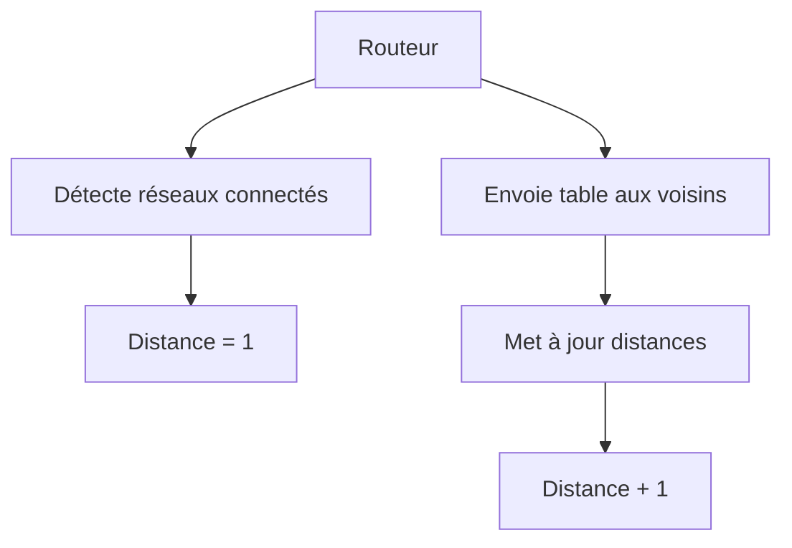
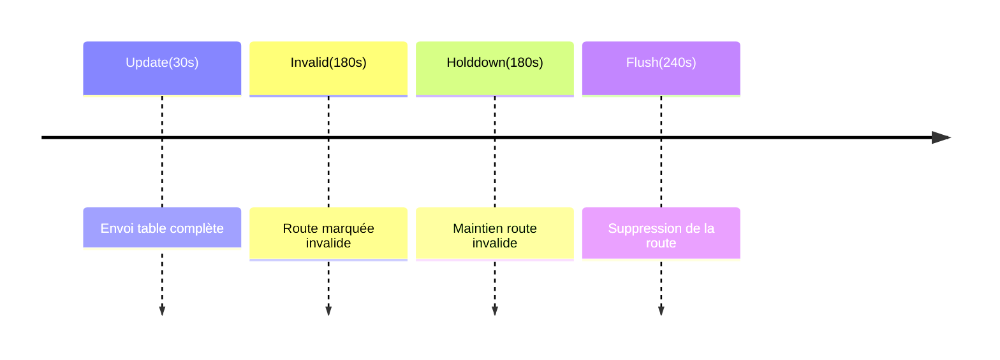

## 1. Concepts Fondamentaux

### Principe de Base


### Vecteur de Distance
- Format : `{adresse_réseau, distance}`
- Exemple : `{192.168.1.0, 1}` signifie "réseau accessible en 1 saut"
- Distance maximale = 15 sauts (16 = inaccessible)

## 2. Fonctionnement Détaillé (Important pour Examens)

### Initialisation d'un Routeur
1. Détection des interfaces actives
2. Calcul des réseaux directement connectés
3. Distance initiale = 1 pour réseaux connectés
4. Envoi de requêtes aux voisins

### Processus de Mise à Jour
1. **Réception d'une mise à jour**
   ```
   Si (route_reçue n'existe pas) {
       Ajouter route
       Distance = distance_reçue + 1
   } Sinon Si (nouvelle_distance < distance_actuelle) {
       Mettre à jour route
   }
   ```

2. **Critères de rejet d'une route**
   - Distance reçue > 15
   - Nouvelle distance totale > 15
   - Route existe avec meilleure métrique

## 3. Les Timers (Crucial pour Examens)

### Détail des Temporisateurs


### Exemple Pratique
```
T0: Route active, distance = 2
T180: Pas de mise à jour -> Route invalide (distance = 16)
T240: Route supprimée de la table
```

## 4. Comparaison RIPv1 vs RIPv2 (Points d'Examen)

### Tableau Comparatif Détaillé
| Caractéristique | RIPv1 | RIPv2 |
|-----------------|-------|--------|
| Classe | Par classe | Sans classe |
| Masque | Non inclus | Inclus |
| Diffusion | 255.255.255.255 | 224.0.0.9 |
| VLSM | Non supporté | Supporté |
| Authentification | Non | MD5 |
| Format mise à jour | Broadcast | Multicast |
| Résumé auto | Oui, obligatoire | Oui, désactivable |

## 5. Règles de Traitement des Routes (Important)

### RIPv1
1. Routes du même réseau principal :
   - Utilise masque de l'interface réceptrice
2. Routes de réseaux principaux différents :
   - Utilise masque par classe

### RIPv2
1. Inclut masque dans mises à jour
2. Support réseaux discontinus
3. Support différents masques pour même réseau

## 6. Cas Pratiques pour Examens

### Exemple 1 : Calcul de Routes
```
Réseau initial : 192.168.1.0
R1 connecté directement : distance = 1
R2 apprend via R1 : distance = 2
R3 apprend via R2 : distance = 3
```

### Exemple 2 : Traitement des Routes

#### Situation Initiale
```
R1: Route vers 192.168.1.0/24, distance = 2
R2: Annonce 192.168.1.0/24, distance = 4
```

#### Décision
R1 ignore la route car sa distance actuelle (2) est meilleure que la nouvelle (4)

## 7. Points Clés pour Exercices

### Calculs de Distance
1. **Règle de base**
   ```
   Nouvelle_Distance = Distance_Reçue + 1
   ```

2. **Vérifications**
   - Distance finale ≤ 15
   - Meilleure que route existante

### Résumé Automatique
1. **RIPv1**
   ```
   Réseau : 192.168.1.0/24
   Résumé à la frontière = 192.168.0.0/16
   ```

2. **RIPv2**
   - Peut désactiver le résumé
   - Supporte VLSM

## 8. Problèmes Courants et Solutions

### Boucles de Routage
1. **Split Horizon**
   - Ne pas annoncer une route sur l'interface d'où elle provient

2. **Route Poisoning**
   - Marquer route comme inaccessible (16)
   - Propager l'information

### Convergence
1. **Problèmes**
   - Count to infinity
   - Informations obsolètes

2. **Solutions**
   - Split horizon
   - Hold down timers
   - Triggered updates

## 9. Questions Types d'Examen

1. **Timer et États**
   - Quand une route devient-elle invalide ?
   - Temps avant suppression définitive ?

2. **Calcul de Routes**
   - Distance totale pour atteindre réseau
   - Choix entre plusieurs chemins

3. **Résumé de Routes**
   - Impact sur la table de routage
   - Différences RIPv1/v2

4. **Dépannage**
   - Identifier causes de boucles
   - Résolution problèmes de convergence

#RP 