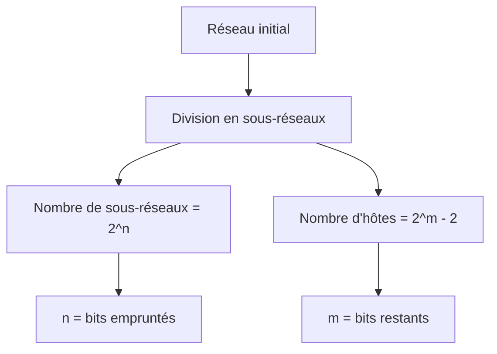
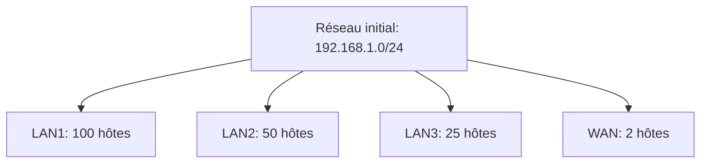

## I. Adressage IPv4 par classe

### Structure de base
- Adresse sur 32 bits
- Format : w.x.y.z (4 octets)
- Exemple : 192.168.10.2
- Composée de deux parties:
  - Partie réseau
  - Partie hôte

### Types d'adresses réseau

#### 1. Adresse réseau
- Plus petite adresse du réseau
- Tous les bits de la partie hôte à 0
- Exemple : 192.110.10.0/24

#### 2. Adresse de diffusion
- Plus grande adresse du réseau
- Tous les bits de la partie hôte à 1
- Types:
  - Diffusion dirigée (vers un réseau spécifique)
  - Diffusion limitée (255.255.255.255)

#### 3. Adresses d'hôtes
- Comprises entre l'adresse réseau et l'adresse de diffusion
- Utilisées pour identifier les périphériques

## II. Classes d'adresses

### Classes principales
| Classe   | Plage d'adresses            | Usage général                           |
| -------- | --------------------------- | --------------------------------------- |
| Classe A | 0.0.0.0 - 127.255.255.255   | Grandes organisations et réseaux        |
| Classe B | 128.0.0.0 - 191.255.255.255 | Moyennes organisations et réseaux       |
| Classe C | 192.0.0.0 - 223.255.255.255 | Petites organisations et réseaux locaux |
| Classe D | 224.0.0.0 - 239.255.255.255 | Multidiffusion (multicast)              |
| Classe E | 240.0.0.0 - 255.255.255.255 | Réservé pour des usages expérimentaux   |
### Types d'adresses spéciales

| Type d'adresse | Plage | Usage |
|----------------|-------|--------|
| Privées Classe A | 10.0.0.0/8 | Réseaux privés |
| Privées Classe B | 172.16.0.0/12 | Réseaux privés |
| Privées Classe C | 192.168.0.0/16 | Réseaux privés |
| Bouclage | 127.0.0.0/8 | Tests locaux |
| Link-local | 169.254.0.0/16 | Auto-configuration |
| Multicast | 224.0.0.0/4 | Diffusion groupée |

## Adressage des sous-réseaux

### Masque de sous-réseau
- Définit la frontière entre partie réseau et partie hôte
- Format décimal pointé ou notation CIDR (/xx)
- Exemple : 255.255.255.0 ou /24

### Calcul des sous-réseaux

## VLSM 

### Principe
- Permet d'utiliser différentes longueurs de masque
- Optimise l'utilisation des adresses
- Adapté aux réseaux de tailles diverses

### Méthodologie VLSM
1. Identifier les besoins en adresses
2. Trier par ordre décroissant
3. Attribuer les sous-réseaux du plus grand au plus petit
4. Utiliser les masques appropriés pour chaque sous-réseau

### Exemple d'application VLSM

### Avantages VLSM
- Utilisation efficace des adresses
- Flexibilité dans la conception
- Support des réseaux hiérarchiques
- Économie d'adresses IP

## Points clés à retenir
- L'adressage IPv4 est hiérarchique
- Les masques définissent la structure réseau
- VLSM permet d'optimiser l'utilisation des adresses
- Les adresses privées nécessitent du NAT pour Internet
- Les classes sont obsolètes mais encore référencées

#RP 